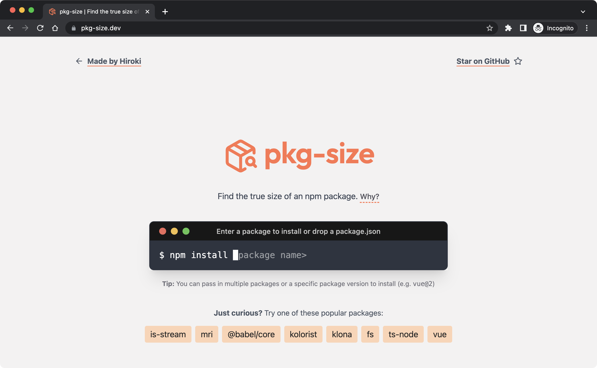
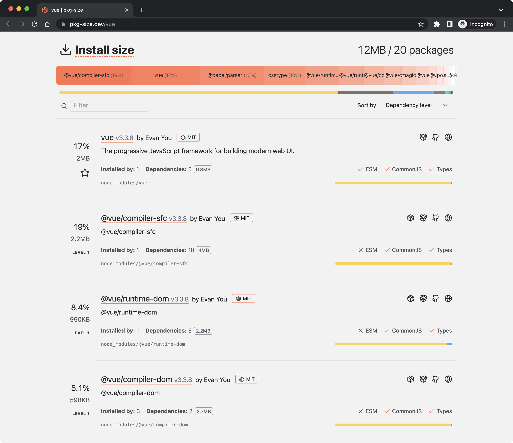
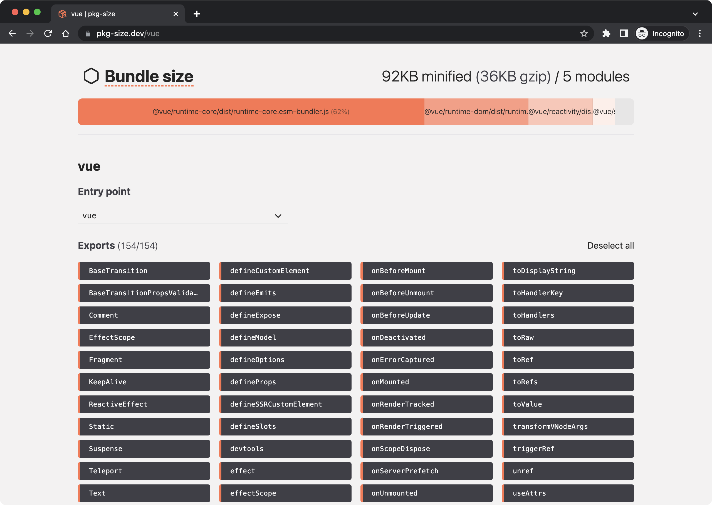

## "npm dependencies are too large"
If you've worked with JavaScript and [npm], you're likely familiar with the notorious `node_modules` directory. This folder houses all your project's dependencies, and is widely known for its hefty size. It's not uncommon for a small project to exceed 100MB, and a quick Google search [reveals](https://stackoverflow.com/questions/64234215/node-modules-size) [many](https://www.reddit.com/r/Angular2/comments/8x8efe/node_modules_is_far_far_too_large_no_idea_how_to/) [frustrated](https://stackoverflow.com/questions/50206572/how-to-reduce-node-modules-in-npm) [devs](https://stackoverflow.com/questions/68236832/node-modules-folder-unnecessarily-large).

<figure class="w-4/5 mx-auto">
	
	<figcaption>A popular meme about `node_modules`</figcaption>
</figure>

While this problem can be improved by npm, the root problem lies within the individual packages installed. Most package authors don't intend to create bulky packages, but they may also not be cognizant of how a few unassuming files in their package can contribute an unwieldy `node_modules` directory.

This problem is also not limited to developers. If you're making a website, these packages are typically bundled together. Inefficiently designed packages will bloat your application and result in slower load times for your users.

To address this situation, the first step is to enter the `node_modules` directory. However, navigating through countless directories with obscure names, each containing numerous files, can be a daunting task.

Questions start swirling in your mind:

_"Which files are essential and which can be removed?"_

_"Which packages are the largest?"_

_"Who can I report these issues to?"_

It's understandable to feel overwhelmed. 

## Your new favorite tool: _pkg-size.dev_

<figure class="w-4/5 mx-auto">
	
	<figcaption>pkg-size.dev</figcaption>
</figure>

[pkg-size.dev] is a powerful online tool designed to answer these questions. It empowers JavaScript developers to examine npm packages effortlessly. It provides valuable insights into the installation size and bundle size of the packages, helping developers make informed decisions when choosing dependencies for their projects.

### Want to see for yourself? Try it out!

Using _pkg-size.dev_ should feel simple and familiar. Just as you would on your computer, start by typing the name of the npm package you want to examine into the terminal. Hit the <kbd>Return</kbd> key, and watch the magic happen. The tool will run `npm install` on the specified package and analyze the `node_modules` directory to get you the size of each package and the total size. It will then bundle the package with esbuild, and analyze that too.

To get started, explore some popular packages:

<!-- Reference packages with dependencies. Zero-dep packages aren't good starting examples -->
- [Vite](http://pkg-size.dev/vite)
- [Webpack](http://pkg-size.dev/webpack)
- [Express](http://pkg-size.dev/express)
- [Axios](http://pkg-size.dev/axios)

### How does it work?

The most incredible part about this tool is all of this happens right within your browser, courtesy of the amazing [WebContainers API]!

WebContainers is a new technology developed by [StackBlitz](https://stackblitz.com) that allows you run Node.js in the browser. No need to set up a new project environment or deal with complex setups. Just a seamless experience right where you're most comfortable.

Because of this, the website can be completely static and doesn't need a backend service. As the author, removing server & maintenance costs was one of the most compelling reasons for creating this tool. It's exciting that many new ideas are now possible with this technology.

## Features to explore

### 1. Install size insights

<figure class="w-4/5 mx-auto">
	
	<figcaption>The "Install size" section for <code>vue</code></figcaption>
</figure>

Once the installation is complete, _pkg-size.dev_ presents you with an informative Install Size section. Here, you'll find a detailed breakdown of every package that was installed during the process. The insights include:

- The largest dependency installed.
- The reasons behind why each package was installed.
- Links to license, repository, homepage, and npm page.
- Whether they have CommonJS/ESM/type distributions.
- The different file types that make up the package.

With this comprehensive information at your fingertips, you can easily evaluate the impact each dependency has and make informed decisions.

Here are some questions you might want to consider for your evaluation:
- Is there a package that's abnormally large?
- Is there a package that's installed unnecessarily?
- Is there a package that can benefit from ESM distribution?
- Is there a package unnecessarily publishing files that can be ignored?
- Is there a CLI package installing TypeScript types?

If you come across any issues or areas for improvement, don't hesitate to report them to the project repository. Your feedback could benefit the entire community.

### 2. Bundle size exploration

<figure class="w-4/5 mx-auto">
	
	<figcaption>The "Bundle size" section for <code>vue</code></figcaption>
</figure>

In addition to the Install Size insights, _pkg-size.dev_ also offers a Bundle Size section. This feature is especially useful when you're dealing with frontend packages that you expect to be bundled together. Unlike the installation size, the bundle size is usually much smaller because it only includes code that is actually referenced in your project, and it's also minified to reduce its footprint. As a tip, the bundle size can also give you an idea of how much bloat is present in your `node_modules` directory.

If the bundled package has an [ESM distribution (JavaScript/ECMAScript Modules)](https://www.w3schools.com/js/js_modules.asp), you can experiment with an exciting optimization called ["tree shaking"](https://developer.mozilla.org/en-US/docs/Glossary/Tree_shaking) to reduce the bundle size even further. Try excluding a named import to see how many bytes it could save in the final bundle. This feature gives you the flexibility to play around with different scenarios and optimize your bundle effectively.

Ready to experiment? Try these ESM packages:

- [Chalk](http://pkg-size.dev/chalk)
- [lodash-es](http://pkg-size.dev/lodash-es)
- [Vue.js](http://pkg-size.dev/vue)

If you find a package that's including a lot of unnecessary code, and could benefit from tree shaking, you can report it to the project repository and help improve their package.

To dive deeper into the bundle size, you can also download the bundle and analyze it locally using your favorite tools.

### 3. Interaction between package dependencies

Another fascinating use-case of _pkg-size.dev_ is observing how multiple packages with shared dependencies interact with each other. By providing multiple package names and specifying their semver ranges, you can gain insights into their compatibility and spot any potential issues.

<figure class="w-4/5 mx-auto">
	
	<figcaption>Pass in multiple packages and semver ranges to see how they interact</figcaption>
</figure>

For example, installing both [`esbuild` and `esbuild-loader@3.0.1`](https://pkg-size.dev/esbuild%20esbuild-loader@3.0.1) reveals that two different versions of `esbuild` are installed due to a mismatch in the semver ranges. This discovery could prompt maintainers to update their dependencies and release an update.

<figure class="w-4/5 mx-auto">
	
	<figcaption>Two different versions of esbuild installed</figcaption>
</figure>

## Have feedback or ideas?

I'm committed to making _pkg-size.dev_ a tool that gives you super powers.

If you have any feedback, feature requests, or bug reports, don't hesitate to share them in the [GitHub repository](https://github.com/privatenumber/pkg-size.dev/issues). Your contributions will help shape the future of this tool.

### Share your insights

As you dive into the npm ecosystem using _pkg-size.dev_, you're bound to discover interesting insights and valuable learnings. Feel free to share your findings in [GitHub Discussions](https://github.com/privatenumber/pkg-size.dev/discussions). These discussions could spark more ideas for features and ways to gain insight.

### Show your support 💞

If you found _pkg-size.dev_ to be useful and save you a lot of time, supporting the project is a fantastic way to show appreciation. If you find the tool useful, please [consider sponsoring it on GitHub](https://github.com/sponsors/privatenumber).

Happy analyzing and exploring the npm world with [pkg-size.dev]! ✌️

[pkg-size.dev]: https://pkg-size.dev
[npm]: https://npmjs.com
[WebContainers API]: https://webcontainers.io
